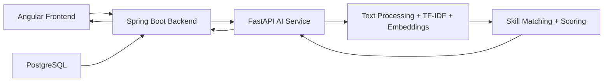

# AI Career Agent

AI Career Agent is a full-stack project that compares a candidate's CV text with a job description and produces a compatibility score, matching skills, and a plain-language summary. The solution is built as a three-part system:

- Frontend: Angular app for interaction and report display
- Backend: Spring Boot API that exposes endpoints and forwards requests to the AI service
- AI service: FastAPI app that performs text preprocessing, skill extraction, TF-IDF scoring, semantic similarity, and final compatibility scoring

This project is designed as a demonstration of an AI-powered recruitment matching workflow and a clean service-oriented architecture.

## Project Goals

- Analyze a CV and a target job description
- Detect overlapping skills and missing required skills
- Compute a deterministic compatibility score using multiple signal types
- Return a human-readable summary of alignment between candidate and role
- Provide a simple UI for quick evaluation and experimentation

## High-Level Architecture

The communication flow is:

1. The Angular frontend sends a CV and a job description to the backend.
2. The backend receives the request and calls the AI service.
3. The AI service preprocesses the text, extracts terms, compares skills, computes similarity scores, and builds the analysis response.
4. The backend returns the result to the frontend for display.
5. PostgreSQL is provisioned through Docker Compose, although the current implementation primarily uses the AI service for the analysis logic.

Flow diagram:



## Tech Stack

### Frontend
- Angular
- TypeScript
- Bootstrap-like custom styling in component templates
- Fetch-based REST communication

### Backend
- Java 21
- Spring Boot 3.4.1
- Spring Web
- Spring Validation
- Actuator

### AI Service
- Python 3
- FastAPI
- Pydantic
- scikit-learn
- NumPy
- pypdf
- python-docx
- pytest

### Infrastructure
- Docker
- Docker Compose
- PostgreSQL 16

## Repository Structure

```text
AI-for-Software-Engineering/
├── README.md
├── docker-compose.yml
├── ai-service/
│   ├── Dockerfile
│   ├── requirements.txt
│   ├── app/
│   │   ├── __init__.py
│   │   ├── main.py
│   │   ├── agents/
│   │   │   └── career_agent.py
│   │   ├── api/
│   │   │   └── routes_analysis.py
│   │   ├── config/
│   │   ├── schemas/
│   │   │   └── analysis.py
│   │   └── tools/
│   │       ├── embedding_tool.py
│   │       ├── pdf_tool.py
│   │       ├── preprocessing_tool.py
│   │       ├── scoring_tool.py
│   │       ├── skill_matching_tool.py
│   │       └── tfidf_tool.py
│   └── tests/
│       ├── test_health.py
│       └── test_tools.py
├── backend/
│   ├── Dockerfile
│   ├── pom.xml
│   └── src/
│       ├── main/
│       │   ├── java/
│       │   │   └── com/aicareeragent/
│       │   │       ├── BackendApplication.java
│       │   │       ├── controller/
│       │   │       │   ├── AnalysisController.java
│       │   │       │   └── HealthController.java
│       │   │       ├── dto/
│       │   │       │   └── AnalysisRequest.java
│       │   │       └── service/
│       │   │           └── AiServiceClient.java
│       │   └── resources/
│       │       └── application.yml
├── frontend/
│   ├── Dockerfile
│   ├── angular.json
│   ├── package.json
│   ├── src/
│   │   ├── app.component.html
│   │   ├── app.component.ts
│   │   ├── main.ts
│   │   └── styles.css
│   ├── tsconfig.json
│   └── tsconfig.app.json
└── docker-compose.yml
```

## How the AI Analysis Works

The AI service is the core of the system. It follows a deterministic pipeline:

1. Input validation
   - Ensures CV text and job description are provided
   - Rejects empty values with HTTP 422 validation errors

2. Text preprocessing
   - Normalizes text and prepares it for token-based matching
   - Uses helper modules for text cleaning and preparation

3. Term extraction
   - Splits CV and job description into keywords
   - Removes common stopwords and duplicates
   - Captures relevant skill-like terms

4. Similarity scoring
   - TF-IDF similarity compares lexical overlap between text sets
   - Embedding similarity estimates semantic closeness using sentence-transformer-style comparisons

5. Skill matching
   - Compares extracted skills from the CV and the role
   - Identifies matching skills and missing required skills

6. Compatibility score
   - Integrates skill overlap and semantic similarity into a final score
   - Returns a value between 0 and 1, which the frontend converts into a displayed percentage

7. Explanation payload
   - The response includes a summary and structured skill information, making the result easier to understand

## API Contracts

### 1) AI Service

Base URL: http://localhost:8000

Endpoint:
- POST /api/analyses

Request body:

```json
{
  "cv_text": "Java Spring Boot developer with experience in REST APIs, SQL, and cloud deployment.",
  "job_description": "We are looking for a Java developer with Spring Boot, REST APIs, and backend microservices experience."
}
```

Response shape:

```json
{
  "analysis_id": "uuid",
  "status": "COMPLETED",
  "result": {
    "compatibility_score": 0.85,
    "models": {
      "tfidf": { "similarity": 0.7 },
      "embeddings": { "similarity": 0.9 }
    },
    "skills": {
      "matching_skills": [
        { "job_skill": "Java" },
        { "job_skill": "Spring Boot" }
      ],
      "missing_required_skills": ["Microservices"]
    },
    "ai_explanation": {
      "summary": "Analysis computed from the provided items.",
      "strengths": [...],
      "skill_gaps": [...]
    }
  }
}
```

Important note:
- This score is a compatibility indicator, not a hiring probability.
- It is intended to be explainable and deterministic rather than a complex production-grade recruitment model.

### 2) Backend

Base URL: http://localhost:8080

Endpoint:
- POST /api/analyses
- GET /health

The backend acts as a gateway. It accepts the same payload schema and forwards the request to the AI service.

### 3) Frontend

The frontend exposes a browser form where the user can paste:
- a CV text
- a job description

Then it calls the backend and renders the score, matching skills, and missing skills.

## Services and Ports

When using Docker Compose, the project runs these containers:

| Service | URL | Purpose |
| --- | --- | --- |
| Frontend | http://localhost:5173 | User interface |
| Backend | http://localhost:8080 | Spring API gateway |
| AI service | http://localhost:8000/docs | FastAPI app and Swagger UI |
| PostgreSQL | localhost:5432 | Data store for future persistence and integration |

## Environment Variables

The Docker Compose setup defines these core environment settings:

### AI Service
- EMBEDDING_MODEL=sentence-transformers/all-MiniLM-L6-v2
- LLM_ENABLED=false

### Backend
- AI_SERVICE_URL=http://ai-service:8000
- SPRING_DATASOURCE_URL=jdbc:postgresql://postgres:5432/ai_career_agent
- SPRING_DATASOURCE_USERNAME=career
- SPRING_DATASOURCE_PASSWORD=career

### Frontend
- VITE_API_URL=http://localhost:8080/api

## Running the Project

### Option 1: Full stack with Docker Compose

From the project root:

```bash
docker compose up --build
```

This starts all services together:
- PostgreSQL
- AI service
- Backend
- Frontend

Then open:
- Frontend: http://localhost:5173
- Backend health: http://localhost:8080/health
- AI service docs: http://localhost:8000/docs

### Option 2: Run services individually

#### 1. AI service

```bash
cd ai-service
python -m venv .venv
source .venv/bin/activate
pip install -r requirements.txt
uvicorn app.main:app --host 0.0.0.0 --port 8000 --reload
```

#### 2. Backend

```bash
cd backend
./mvnw spring-boot:run
```

If Maven wrapper is not available, use:

```bash
mvn spring-boot:run
```

#### 3. Frontend

```bash
cd frontend
npm install
npm run start
```

## Testing

### AI service tests

```bash
cd ai-service
pytest
```

The tests cover:
- health endpoint behavior
- validation of empty CV values
- deterministic scoring
- skill matching logic
- completion of a full agent analysis response

## Notes on Current Implementation

This project is a working demonstration rather than a full production-grade recruiter system. Some important practical notes:

- The AI service computes a deterministic score using a combination of lexical and semantic features.
- It extracts keyword-style terms rather than deeply parsing full CV semantics.
- The PostgreSQL database is prepared in Docker Compose but is not yet central to the current request flow.
- The frontend is intentionally simple and focused on demonstrating the analysis pipeline.
- The system is designed to be extendable with richer parsing, resume extraction, LLM explanations, and database-backed results.

## Potential Future Improvements

- CV parsing from PDF/DOCX files with real document ingestion
- More advanced skill extraction using NLP pipelines or LLMs
- Persistent analysis storage in PostgreSQL
- Job recommendation and candidate ranking histories
- User authentication and saved profiles
- Better explanation generation and richer analytics dashboards

## Example Request

You can test the backend from the command line using curl:

```bash
curl -X POST http://localhost:8080/api/analyses \
  -H "Content-Type: application/json" \
  -d '{
    "cv_text": "Software engineer with Java, Spring Boot, REST APIs, and PostgreSQL experience.",
    "job_description": "Senior Java developer with Spring Boot, microservices, SQL, and backend architecture skills."
  }'
```

## Summary

AI Career Agent demonstrates how a modern AI-enabled recruitment workflow can be structured in a modular system:

- frontend for user experience
- backend for API orchestration
- AI service for scoring and explainability
- containerized deployment for easy local setup

It is a practical starting point for building a smarter candidate-to-role matching solution.
