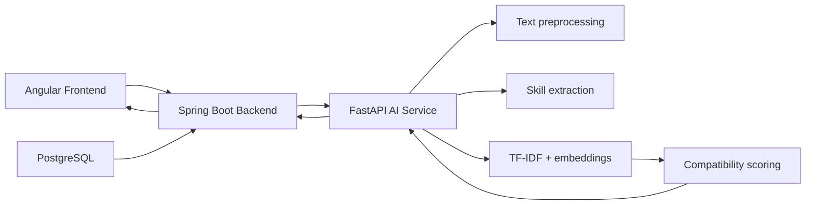

# AI Career Agent

AI Career Agent is a full-stack application for comparing a candidate CV with a job description and generating a compatibility score, matched skills, and a simple explainable summary.

The project combines:
- an Angular frontend for user interaction
- a Spring Boot backend as the API layer
- a FastAPI AI service for the analysis logic
- PostgreSQL in Docker for local infrastructure

## What this project does

The application lets a user paste:
- CV text
- a job description

Then it calculates:
- TF-IDF similarity
- embedding-based semantic similarity
- skill overlap and missing skills
- a final compatibility score
- a concise result summary for the user

This is a demonstration project for AI-powered recruitment matching, not a production hiring system.

## Architecture



## Tech stack

### Frontend
- Angular
- TypeScript
- HTML/CSS
- Fetch API for REST calls

### Backend
- Java 21
- Spring Boot 3.4.1
- Spring Web
- Spring Validation
- Spring Actuator

### AI service
- Python
- FastAPI
- Pydantic
- scikit-learn
- NumPy
- pypdf
- python-docx
- pytest

### Infrastructure
- Docker
- Docker Compose
- PostgreSQL 16

## Repository structure

```text
AI-for-Software-Engineering/
├── README.md
├── docker-compose.yml
├── ai-service/
│   ├── Dockerfile
│   ├── requirements.txt
│   ├── app/
│   │   ├── __init__.py
│   │   ├── main.py
│   │   ├── agents/
│   │   │   └── career_agent.py
│   │   ├── api/
│   │   │   └── routes_analysis.py
│   │   ├── schemas/
│   │   │   └── analysis.py
│   │   ├── tools/
│   │   │   ├── embedding_tool.py
│   │   │   ├── pdf_tool.py
│   │   │   ├── preprocessing_tool.py
│   │   │   ├── scoring_tool.py
│   │   │   ├── skill_matching_tool.py
│   │   │   └── tfidf_tool.py
│   │   └── config/
│   └── tests/
│       ├── test_health.py
│       └── test_tools.py
├── backend/
│   ├── Dockerfile
│   ├── pom.xml
│   └── src/
│       ├── main/
│       │   ├── java/
│       │   │   └── com/aicareeragent/
│       │   │       ├── BackendApplication.java
│       │   │       ├── controller/
│       │   │       │   ├── AnalysisController.java
│       │   │       │   └── HealthController.java
│       │   │       ├── dto/
│       │   │       │   └── AnalysisRequest.java
│       │   │       └── service/
│       │   │           └── AiServiceClient.java
│       │   └── resources/
│       │       └── application.yml
├── frontend/
│   ├── Dockerfile
│   ├── angular.json
│   ├── package.json
│   ├── tsconfig.json
│   ├── tsconfig.app.json
│   └── src/
│       ├── app.component.html
│       ├── app.component.ts
│       ├── main.ts
│       └── styles.css
└── docker-compose.yml
```

## Startup

From the project root, run:

```bash
docker compose up --build
```

### Access points

- Frontend: http://localhost:5173
- Backend health check: http://localhost:8081/health
- AI service docs: http://localhost:8000/docs
- PostgreSQL: localhost:5432

> Note: the Spring Boot app listens internally on port 8080, and Docker maps it to 8081 on the host machine.

## Service behavior

### Frontend
The Angular app provides a form where the user enters:
- CV text
- job description

After submission, it calls the backend and renders the result panel.

### Backend
The backend exposes the API and proxies the request to the AI service.

Relevant route:
- POST /api/analyses
- GET /health

### AI service
The AI service is the analysis engine.

Relevant route:
- POST /api/analyses
- GET /health

The main logic is implemented in the agent and tools layer.

## AI analysis flow

The analysis pipeline is deterministic and uses several signals:

1. Input validation
   - both CV text and job description must be non-empty
2. Text preprocessing
   - normalize and clean the candidate text
3. Keyword extraction
   - gather relevant terms from both texts
4. Similarity scoring
   - TF-IDF lexical comparison
   - embedding-based semantic comparison
5. Skill matching
   - match job skills against candidate skills
   - identify missing required skills
6. Final score
   - compute the compatibility score and package the response

## API contract

### AI service request

```json
{
  "cv_text": "Java developer with Spring Boot, REST APIs, SQL and cloud deployment experience.",
  "job_description": "We need a Java engineer with Spring Boot, REST APIs, backend services and SQL experience."
}
```

### AI service response

```json
{
  "analysis_id": "a1b2c3d4-...",
  "status": "COMPLETED",
  "result": {
    "compatibility_score": 0.85,
    "models": {
      "tfidf": { "similarity": 0.72 },
      "embeddings": { "similarity": 0.9 }
    },
    "skills": {
      "matching_skills": [
        { "job_skill": "Java" },
        { "job_skill": "Spring Boot" }
      ],
      "missing_required_skills": ["Microservices"]
    },
    "ai_explanation": {
      "summary": "Analysis computed from the provided items.",
      "strengths": [],
      "skill_gaps": []
    }
  }
}
```

## Running locally without Docker

### AI service

```bash
cd ai-service
python -m venv .venv
source .venv/bin/activate
pip install -r requirements.txt
uvicorn app.main:app --host 0.0.0.0 --port 8000 --reload
```

### Backend

```bash
cd backend
mvn spring-boot:run
```

### Frontend

```bash
cd frontend
npm install
npm run start
```

## Testing

### AI service

```bash
cd ai-service
pytest
```

The tests currently cover:
- health endpoint
- validation for empty input
- deterministic score behavior
- skill matching logic
- complete agent report generation

## Important notes

- The score is intended as an explainable compatibility indicator, not a hiring probability.
- The system is a reusable prototype for matching CVs to job openings.
- PostgreSQL is included in Docker Compose but is not yet the primary execution layer for the analysis logic.
- The current implementation focuses on a simple, transparent evaluation pipeline rather than full production recruitment features.

## Example cURL request

```bash
curl -X POST http://localhost:8081/api/analyses \
  -H "Content-Type: application/json" \
  -d '{
    "cv_text": "Software engineer with Java, Spring Boot, REST APIs, and PostgreSQL experience.",
    "job_description": "Senior Java developer with Spring Boot, microservices, SQL, and backend architecture skills."
  }'
```

## Summary

This project is a practical example of an AI-assisted recruitment matching workflow built across three layers:
- frontend for user interaction
- backend for API orchestration
- AI service for matching and scoring

It is a good starting point for extending the solution with richer candidate parsing, database persistence, deeper NLP techniques, and production-ready hiring analytics.
